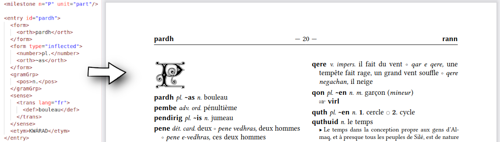

# teidict.sile

[](LICENSE)
[](https://github.com/Omikhleia/teidict.sile/actions?workflow=Luacheck)
[](https://luarocks.org/modules/Omikhleia/teidict.sile)

This package collection for the [SILE](https://github.com/sile-typesetter/sile) typesetter
aims at supporting the (XML) TEI P4 “Print Dictionary” standard — or, more precisely,
a certain subset of it, as suitable for the [Sindarin dictionary project](https://github.com/Omikhleia/sindict),
so that to generate a PDF out of it.

The main pain point is that such a dictionary uses a heavily “semantic” structured
mark-up (i.e. a “lexical view”, encoding structure information such as part-of-speech
etc. without much concern for the exact textual representation in print form),
much more than a “presentational” mark-up. Some XML nodes may contain many things
one needs to ignore (such as spaces, mostly) or to supplement (such as punctuation,
parentheses, numbering, bits of translation… and again, proper spaces where needed).
Without XPath to check siblings, ascendants or descendants, it may become somewhat
hard to get a nice automated output (and even with XPath, it is not _that_ obvious).
In other terms, the solution proposed here is somewhat _ad hoc_ for a specific type
of lexical TEI dictionary and depends quite a lot on its structural organization.

Would you want to use this package and know more about the supported structure and tags,
then refer to the [Data Model](https://omikhleia.github.io/sindict/manual/DATA_MODEL.html)
of the Sindarin Dictionary project.



## Installation

These packages require SILE v0.14 or upper.

Installation relies on the **luarocks** package manager.

To install the latest development version and all its dependencies (see below), you may use the provided “rockspec”:

```
luarocks --lua-version 5.4 install --server=https://luarocks.org/dev teidict.sile
```

(Refer to the SILE manual for more detailed 3rd-party package installation information.)

**Note**: This collection also uses other SILE packages, such as:

- The [resilient](https://github.com/Omikhleia/resilient.sile) collection, for styling and
  other layout features.
- The [couyards](https://github.com/Omikhleia/couyards.sile) package, for typographic ornaments.

When installed with luarocks, these dependencies are automatically installed too.

If you are using this repository from a Git clone, though, you will have to install them manually.

## License

All the **code** in this repository is licensed under the MIT License.

This repository also includes a simple dictionary example — a small XML (TEI P4) lexicon
(Almaqerin-French) — which is provided under license CC-BY-NC-SA 2.0 as a special arrangement.

More generally, any example (i.e. anything in the "examples" folder) may have its own
license, and is used here by courtesy of the author(s). Please check the license(s)
or ask, in case of doubts, for details and exact licensing terms.
